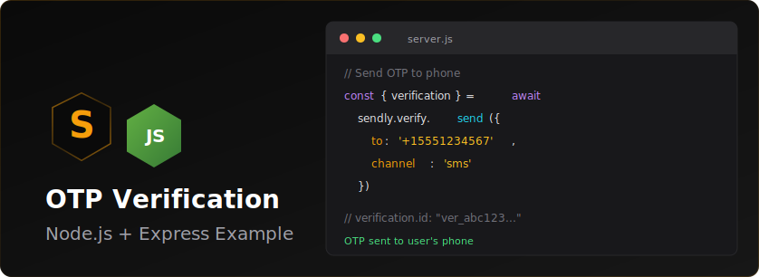

<p align="center">
  
</p>


# Sendly Next.js OTP Verification Example

A complete example application demonstrating phone number verification with OTP (One-Time Password) using Sendly's verification API in a Next.js application.

## Features

- Phone number input with E.164 format support
- OTP code generation and SMS delivery via Sendly
- 6-digit code verification
- Resend code functionality
- Clean, responsive UI with no external CSS frameworks
- Full TypeScript support
- Proper error handling

## Prerequisites

- Node.js 18+ installed
- A Sendly account and API key
- npm or yarn package manager

## Getting Your Sendly API Key

1. Sign up for a Sendly account at [https://sendly.live](https://sendly.live)
2. Navigate to your dashboard
3. Go to Settings > API Keys
4. Copy your API key
5. In sandbox mode, you can test without sending real SMS messages

## Installation

1. Clone or download this example:

```bash
cd sendly-nextjs-otp-example
```

2. Install dependencies:

```bash
npm install
```

3. Create a `.env.local` file in the root directory:

```bash
cp .env.example .env.local
```

4. Add your Sendly API key to `.env.local`:

```
SENDLY_API_KEY=your_actual_api_key_here
```

## Running the Application

Start the development server:

```bash
npm run dev
```

Open your browser and navigate to [http://localhost:3000](http://localhost:3000)

## How It Works

### The Verification Flow

1. **Phone Number Entry** (`/`)
   - User enters their phone number in E.164 format (e.g., +1234567890)
   - Clicks "Send OTP" button
   - App calls `/api/send-otp` to generate and send verification code

2. **OTP Delivery**
   - Sendly generates a 6-digit code
   - Sends SMS to the provided phone number
   - Returns a verification ID for tracking

3. **Code Verification** (`/verify`)
   - User enters the 6-digit code received via SMS
   - App calls `/api/verify-otp` with the verification ID and code
   - Sendly validates the code and returns success or failure

4. **Success/Failure**
   - On success: Shows confirmation message
   - On failure: Displays error and allows retry or resend

### Project Structure

```
sendly-nextjs-otp-example/
├── app/
│   ├── api/
│   │   ├── send-otp/
│   │   │   └── route.ts          # API route to send OTP
│   │   └── verify-otp/
│   │       └── route.ts          # API route to verify OTP
│   ├── verify/
│   │   └── page.tsx              # OTP verification page
│   ├── layout.tsx                # Root layout with styling
│   └── page.tsx                  # Home page with phone input
├── .env.example                  # Environment variables template
├── .env.local                    # Your local environment variables (create this)
├── next.config.js                # Next.js configuration
├── package.json                  # Dependencies
├── tsconfig.json                 # TypeScript configuration
└── README.md                     # This file
```

## Code Explanation

### API Routes

**`/api/send-otp`**
```typescript
// Initializes Sendly client with API key
const sendly = new Sendly(process.env.SENDLY_API_KEY);

// Sends OTP to phone number
const verification = await sendly.verify.send({
  to: phone,
});

// Returns verification ID for later use
return { verificationId: verification.id };
```

**`/api/verify-otp`**
```typescript
// Checks if the provided code matches
const result = await sendly.verify.check(id, {
  code,
});

// Returns success if status is 'approved'
if (result.status === 'verified') {
  return { success: true };
}
```

### Client Components

**Phone Input Page** (`app/page.tsx`)
- Form for phone number entry
- Calls send-otp API
- Redirects to verify page with verification ID

**Verification Page** (`app/verify/page.tsx`)
- 6-digit code input
- Calls verify-otp API
- Shows success/error messages
- Allows resending code

## Testing in Sandbox Mode

When using Sendly in sandbox mode:

1. No real SMS messages are sent
2. You can use any phone number format
3. Check Sendly dashboard for test verification codes
4. All API functionality works identically to production

## Customization

### Styling
All styles are inline in `app/layout.tsx`. You can easily:
- Change colors by modifying the gradient and button backgrounds
- Adjust spacing and sizing
- Add your own CSS framework if desired

### Phone Number Format
The example uses E.164 format (+1234567890). To add phone number formatting:
- Install a library like `libphonenumber-js`
- Add formatting logic in the phone input component

### Code Length
The example uses 6-digit codes. To change this:
- Modify the `maxLength` prop in the code input
- Update the pattern validation
- Configure code length in Sendly dashboard settings

## Production Considerations

Before deploying to production:

1. Set up proper environment variables in your hosting platform
2. Add rate limiting to prevent abuse
3. Implement session management for verified users
4. Add phone number validation and formatting
5. Set up error logging and monitoring
6. Review Sendly pricing and upgrade from sandbox if needed
7. Add CAPTCHA or other bot protection
8. Implement proper authentication after verification

## Troubleshooting

**"SENDLY_API_KEY is not configured"**
- Ensure `.env.local` exists with your API key
- Restart the development server after adding environment variables

**"Failed to send OTP"**
- Check your Sendly API key is valid
- Verify phone number is in correct format
- Check Sendly dashboard for API errors

**"Invalid or expired code"**
- Codes typically expire after 10 minutes
- Ensure you're entering the correct 6-digit code
- Try resending a new code

## Learn More

- [Sendly Documentation](https://docs.sendly.live)
- [Next.js Documentation](https://nextjs.org/docs)
- [Next.js App Router](https://nextjs.org/docs/app)

## License

This example is open source and available for any use.
